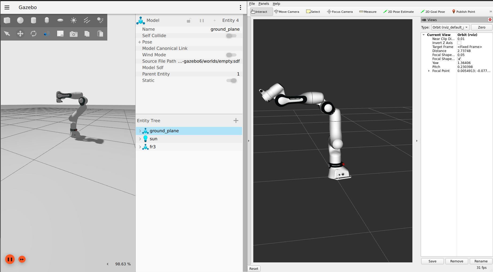

AGIMUS demo 00 Franka Controller
--------------------------------

This demo checks whether of ROS 2 dependencies for Franka robots was done correctly.

### Dependencies

This demo requires source built of dependencies found in:
- [fraka.repos](../franka.repos)

### Simulation

> [!NOTE]
> Gazebo simulation of Franka robots require very high frequency of the simulated environment, hence users might experience high CPU utilization or even errors in cases where older and less powerful computers are used.

To launch the demo run:

```bash
ros2 launch agimus_demo_00_franka_controller bringup.launch.py use_gazebo:=true use_rviz:=true
```
Expected result: after starting the demo, a Ignition Gazebo and a RViz 2 windows should be appearing with the Franka robot moving in oscillating motion.



### Real robot

First turn on the robot and unlock joint in the web-ui. Move the robot a safe position allowing for a full range of joint motion while avoiding collisions with environment and not posing any threat to safety of people around.

> [!CAUTION]
> Before starting the launch file make sure robot is in a safe position and has sufficient movement space for it's joints and is not likely to collide with anything. Ensure all spectators are in a safe distance from the machine, a operator can quickly reach **Emergency Button** in case error occurs!

> [!NOTE]
> Robot will start oscillating around starting point. When restarting the demo make sure robot was stopped with sufficient joint motion left, as during a re-run it might trigger joint limit safety!

Launch the demo

```bash
ros2 launch agimus_demo_00_franka_controller bringup.launch.py robot_ip:=<robot-ip> use_rviz:=true
```
Expected result: after starting the demo, a RViz 2 window should be appearing with the Franka robot moving in oscillating motion. Robot should follow the same oscillatory trajectory as the one in previous example.
